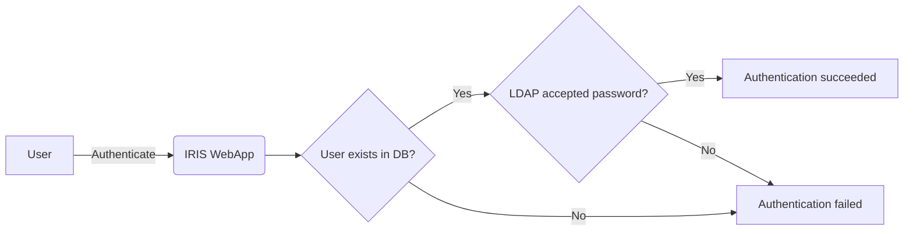

# Authentication 
IRIS supports local and LDAP authentication. In both cases, users need to be declared in IRIS.   

## Local authentication 
Local authentication is the default setting. The password is validated against the local IRIS database.  
Passwords are stored salted and hashed, it is thus not possible to retrieve them in case they are lost. It is however possible to change them.   

### Settings 
Two settings present in `.env` when dealing with IRIS authentication.  

!!! danger "Critical settings"
    These settings are critical and need to be set properly otherwise authentication bypass may occur 


- `IRIS_SECRET_KEY` : The key used by IRIS to generate session tokens. If known or not random, a malicious actor could craft a session token that could effectively bypass the authentication  
- `IRIS_SECURITY_PASSWORD_SALT`: The salt used to hash the `random_salt + password` 

These values can be generated with Python 3 and the following lines.  
```python
import secrets 
secrets.token_hex(32)
```


### Changing a lost password
**If another administrative user exists** : Being logged as this user, head to the `Advanced` > `Access Control` > `Users` section, and change the administrator password. 

**If no other administrative user exists** : the change cannot be done via IRIS and an access to the backend is needed.  

!!! danger "Danger"
    Do not delete and recreate any users directly from the DB! This will create inconsistencies in the relations and certainly corrupt everything. 

1. Generate the hash of the new password with Python BCrypt in Python prompt
   
    ```python
    import bcrypt
    print(bcrypt.hashpw(<new_password>.encode('utf-8'), bcrypt.gensalt())
    ```

2. Connect to the DB docker then the Postgresql database `iris_db` and update the password 

    ```bash
    docker exec -ti <db_docker_id> /bin/bash
    / # su postgres
    / # psql
    postgres=# \c iris_db 
    postgres=# UPDATE "user" SET password = '<hash>' WHERE "user".name = 'administrator';
    ```


## LDAP authentication 
LDAP authentication rely on a LDAP server to verify the password of a user.    
**The user needs to be declared in IRIS**.   



### Settings 
The LDAP settings are present in the `.env`. The following values can be set.  

```python
IRIS_AUTHENTICATION_TYPE=ldap
## IP address or FQDN of the ldap server
LDAP_SERVER=127.0.0.1

## Port of the LDAP server
LDAP_PORT=3890

## Prefix to search the users within 
LDAP_USER_PREFIX=uid=

## Suffix to search the users within
LDAP_USER_SUFFIX=ou=people,dc=example,dc=com

## Set to True to use LDAPS
LDAP_USE_SSL=False

## Set to True to verify the server certificate validity 
LDAP_VALIDATE_CERTIFICATE=True

## TLS version to use LDAPS
LDAP_TLS_VERSION=1.2

## Path of the LDAP server certificate and private key. 
## When using docker, the path should be a valid path within the docker. 
## The default mounted directories in IRIS can be used for permanent storage. 
LDAP_SERVER_CERTIFICATE=
LDAP_PRIVATE_KEY=
LDAP_PRIVATE_KEY_PASSWORD=
```

Once the LDAP server information is set, reboot the Iris WebApp docker.  
```bash
docker-compose restart app
```

#### Setting up LDAP for the first runtime of IRIS 
To set up LDAP without having run IRIS priorly, and as the app needs the accounts to be created first before using LDAP, one have to set the `IRIS_ADM_EMAIL` environment with the LDAP Email of the administrator user.  

```bash title="Example of LDAP configuration for first run"
IRIS_AUTHENTICATION_TYPE=ldap
## IP address or FQDN of the ldap server
LDAP_SERVER=127.0.0.1

## Port of the LDAP server
LDAP_PORT=3890

## Prefix to search the users within 
LDAP_USER_PREFIX=uid=

## Suffix to search the users within
LDAP_USER_SUFFIX=ou=people,dc=example,dc=com

## Set to True to use LDAPS
LDAP_USE_SSL=False

# Set email address of admin 
IRIS_ADM_EMAIL=adm@example.com 
```

#### Setting up LDAP after IRIS already ran
To set up LDAP after IRIS was already run, one only needs to set up the settings described previously.  

!!! Info "**Usernames in IRIS have to match the ones set in LDAP for the authentication to succeed.**" 

