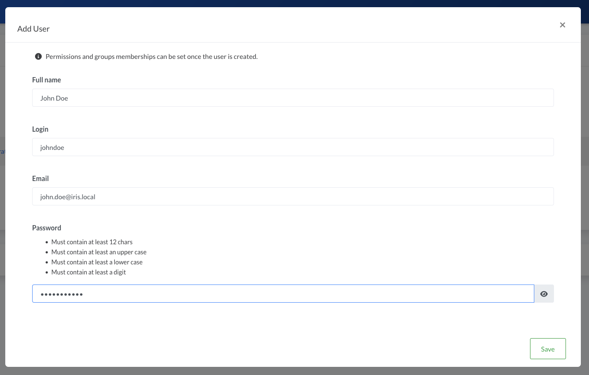
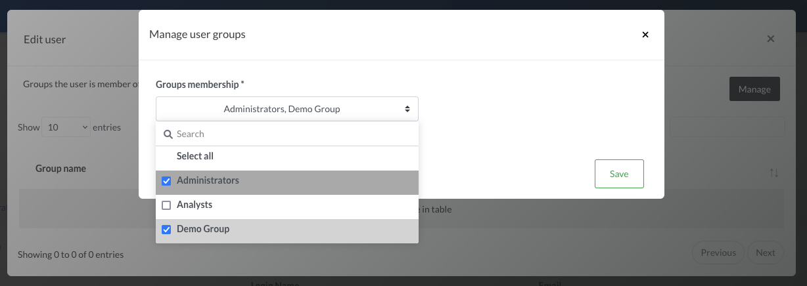
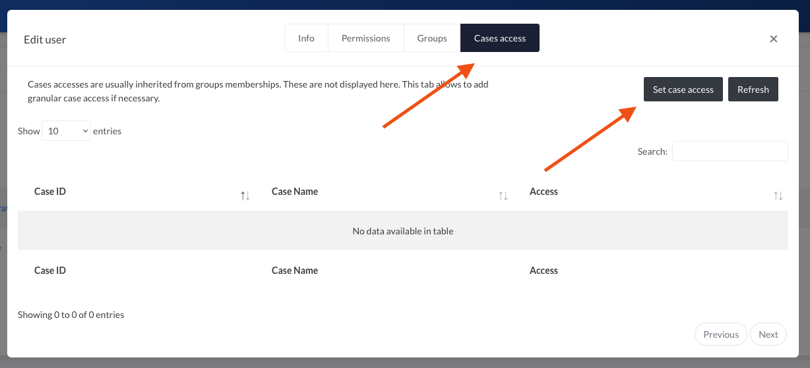
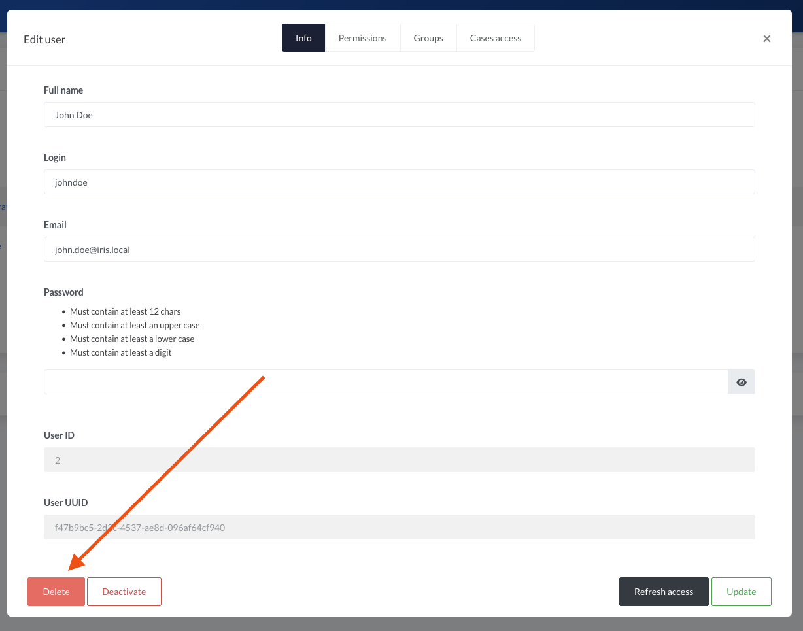

# Users

!!! tip "Authentication"
    Looking for authentication settings? [It's here](authentication.md)

Whatever the authentication mechanism used (Local or LDAP), the users have to be declared in IRIS.   

## Adding a user 
Head to `Advanced` > `Access Control` > `Users` and click `Add user`.  
All fields of the form are required. All information can be changed after the creation.   

!!! tip "Note" 
    Permissions and groups can be set once the user is created.   

- **Full Name** : Name of the user to add 
- **Login** : Username used to login in IRIS. Has to be unique on the instance 
- **Email** : Email of the user to add. Has to be unique on the instance  
- **Password**: Password respecting the policy defined in `Advanced` > `Server settings`. The password also has to be set when using LDAP. It is however not used for the authentication.    

 

## Editing a user 
A user can be edited by clicking on its name or ID in `Advanced` > `Access Control` > `Users`.  A window opens and display the user's information. Tabs at the top allows to configure multiple settings related to the user.   

## Setting permissions
Permissions of a user cannot be set directly. They are inherited from the groups membership. The tab `Permissions` only displays the permissions the user has from its groups memberships. 
See [Groups](groups.md) for more info.   

## Setting groups 
Groups can be set by clicking on the `Groups` tab of the user's window and then `Manage`.      

 

A new window appear with the possibility to select the groups the user should belong to. 
 

After saving, the permissions of the user are updated. This can be verified in the `Permissions` tab.   
 

## Setting cases access 
Cases access are usually set through groups membership. However for granularity they can be set per user.   
To set the access of a user on a case, click on the `Cases access` tab of the user's window and then `Set case access`.   

 

As for the Groups, a selector appear and allows to select one or multiple cases and the access to associate.       
 

!!! info 
    Application of a case access is immediate, even if the user is logged in and browsing the case.  

!!! info 
    Granular case access can also be set from a case itself, in `Summary` > `Manage` > `Access`.  

## Deactivating a user
A user can be deactivated, which has the following impact: 

- User cannot login anymore 
- User cannot use its API key anymore 
- User is not proposed in tasks assignees anymore 

 

## Deleting a user 
It is usually not possible to delete a user. This is to keep consistency in the database. A user can be deleted if it has done absolutely no actions on the platform. If a user leaves the organisation, it is recommended to rename the user and deactivate it.  

 