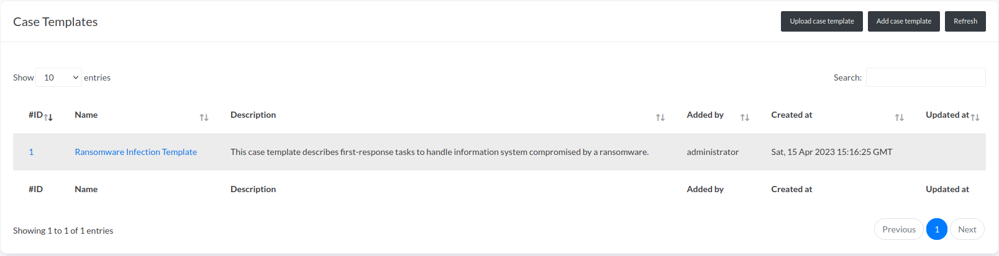
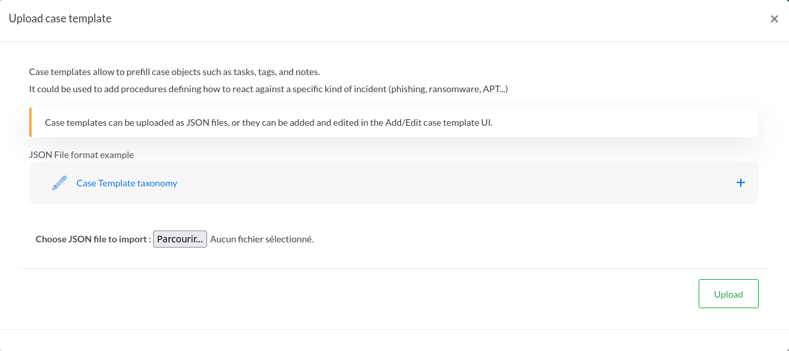
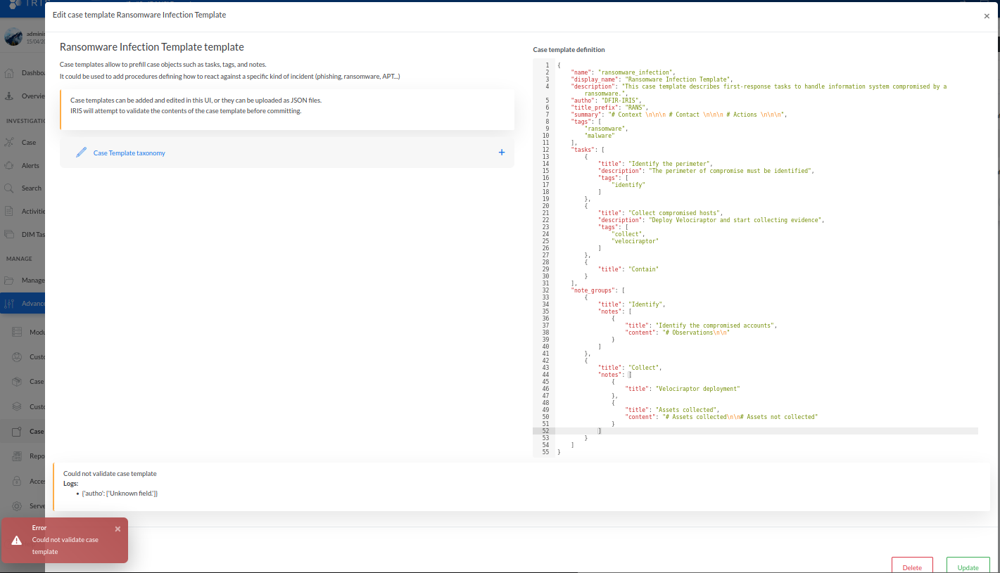
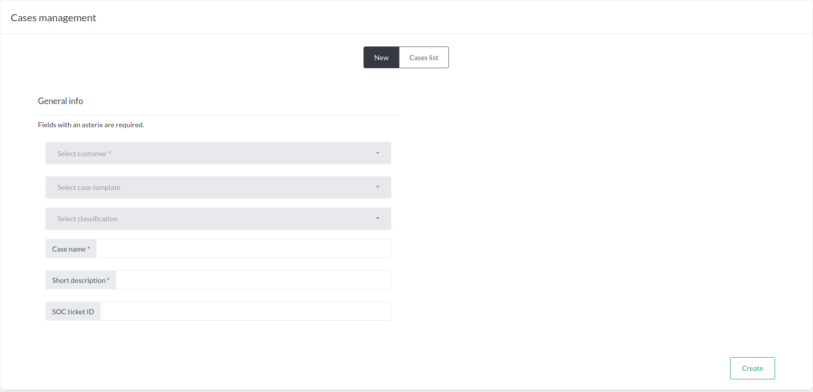
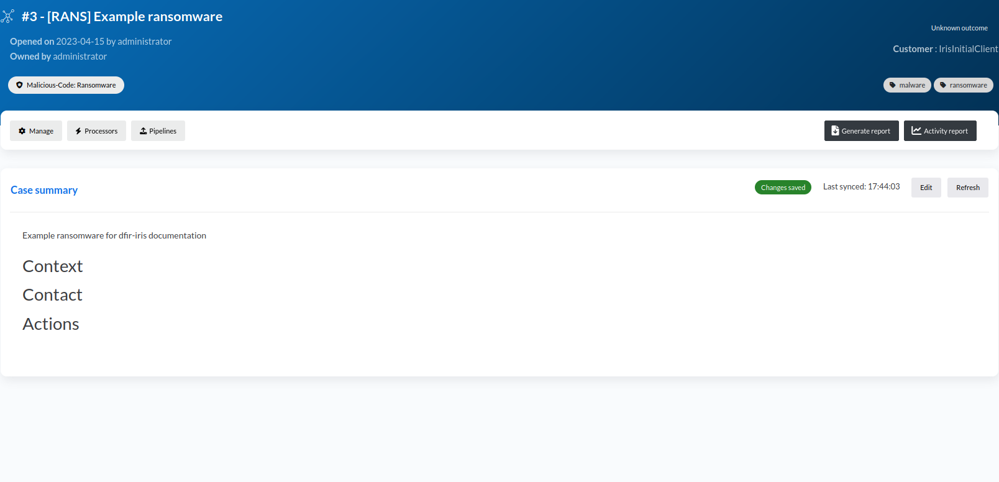
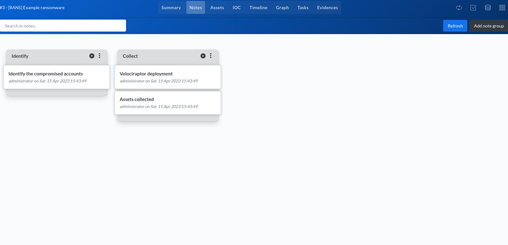
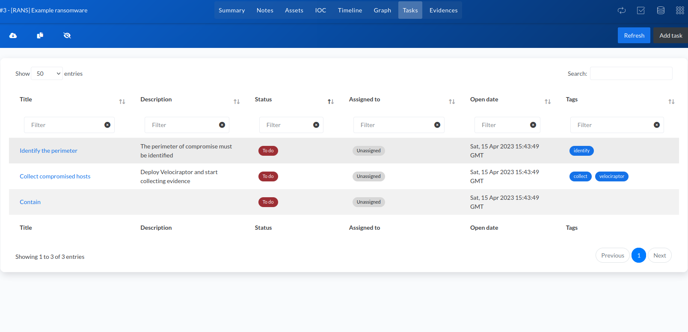

# Case Templates 

!!! tip "*Introduced in IRIS v2.1.0*"

Cases can be initialised with case templates. Case templates allow to prefill case objects such as tasks, tags, and notes.
It could be used to add procedures defining how to react against a specific kind of incident (phishing, ransomware, APT...), and is a way to share knowledge between teams and the community. 

This section only describes how an administrator can add, edit or delete a case template to the IRIS web instance.  

## Management page

Case templates can be managed in the ``Advanced`` > ``Case Templates`` section on the left panel. 



New case templates can be either uploaded as a JSON file or added directly from the UI editor.

### Upload a case template JSON file

Click on ``Upload case template`` and import a JSON file respecting the case template taxonomy (described further).



### Add or modify a case template

Click on ``Add case template`` to start writing a new case template. You can also click on an existing case template to modify it.
The UI editor has completion and validation checks that can help you to correctly write your template.



### Delete a case template

To delete a case template, open it and click on the Delete red button, next to the "Update" button.

## Using case templates during case creation

Once defined, case templates can be used during the process of case creation.

Cases can be created in the ``Manage cases`` > ``New`` section on the left panel.

The case template can be selected from the dropdown list labeled "Select case template".



Once the case attributes submitted with a case template, the new case will be automatically populated with information contained in the case template.







## Case template fields taxonomy 

The available fields type are available for templating the case, and some case template metadata : 

- ``name``: the name of the case template (**required**). Just a way to label internally a case template. 
    - Example: ``"ransomware_infection_template"``.
- ``display_name``: the displayed name of the case template. This is the more human-friendly flavour of ``name``.
    - Example: ``"Ransomware Infection Template"``.
- ``description``: the description of the case template.
    - Example: ``"This case template describes first-response tasks to handle information system compromised by ransomware."``
- ``author``: the author of the case template (not related to the current user). This is useful if you want to share your templates to the community.
- ``title_prefix``: a prefix to add to case title. It is a way to tag the name of the case.
    - Example: ``"RANS"``. If a new case named "Europe BU breached" is built from this case template, its full name will be "#id - [RANS] Europe BU breached".
- ``summary``: adds content to the summary. You could add some general structure of the summary using markdown syntax. Special characters like new lines must be encoded (\n).
    - Example: ``"# Context\n\n\n# Contact\n\n\n# Actions"``.
- ``tags``: a list of case tags. Those tags will be used to label the case itself. Must be in a JSON list format.
    - Example: ``["ransomware", "data breach"]``
- ``tasks``: a list of dictionaries defining tasks. Tasks are defined by title (**required** when defining a task), description, and list of tags.
    - Example: ``[{"title": "Identify the perimeter", "description": "The perimeter of compromise must be identified", "tags":"identify"}]``
- ``note_groups``: a list of dictionaries defining note groups. Note groups are defined by title (required), and list of notes. Notes have title (required) and content.
    - Example: ``[{"title": "Identify", "notes": [{"title": "Identify the compromised accounts", "content": "# Observations\n\n"}]}]``

## Example 

```json title="Case template example"
{
    "name": "ransomware_infection",
    "display_name": "Ransomware Infection Template",
    "description": "This case template describes first-response tasks to handle information system compromised by a ransomware.",
    "author": "DFIR-IRIS",
    "title_prefix": "RANS",
    "summary": "# Context \n\n\n# Contact \n\n\n# Actions \n\n\n",
    "tags": ["ransomware","malware"],
    "tasks": [
        {
            "title": "Identify the perimeter",
            "description": "The perimeter of compromise must be identified",
            "tags": ["identify"]
        },
        {
            "title": "Collect compromised hosts",
            "description": "Deploy Velociraptor and start collecting evidence",
            "tags": ["collect", "velociraptor"]
        },
        {
            "title": "Contain"
        }
    ],
    "note_groups": [
        {
            "title": "Identify",
            "notes": [
                {
                    "title": "Identify the compromised accounts",
                    "content": "# Observations\n\n"
                }
            ]
        },
        {
            "title": "Collect",
            "notes": [
                {
                    "title": "Velociraptor deployment"
                },
                {
                    "title": "Assets collected",
                    "content": "# Assets collected\n\n# Assets not collected"
                }
            ]
        }
    ]
}
```
