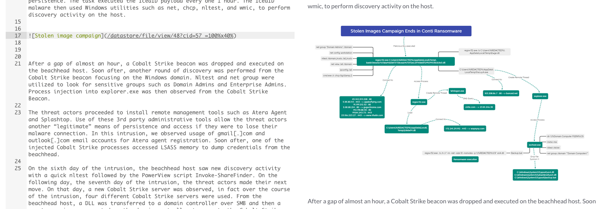

# Datastore

!!! tip "*Introduced in IRIS v1.4.5*"

The datastore offers a way to store files directly in the context of a case. Documents, IOCs, evidences, etc, anything can be uploaded and managed through IRIS.  

## Accessing the datastore 
The datastore can be accessed from any page with the top-right shortcut.  

A new pane will open, with a default folder tree created for the case.  

## Files

### Adding a file 

To add a file to a folder, press the `+` button near a folder where you want to place it, and select `Add file`. 

A new window appear and allows to upload the file. The following fields are available : 

- **Filename** : Name of the file to upload. Automatically detected when a file is selected,
- **Description** : An optional description of the file,
- **Password** : An optional password to encrypt the file in a zip with. Files marked as IOC are automatically protected with `infected` unless specified otherwise in this field,
- **Tags** : Optional tags to help filtering later on, 
- **File is IOC** : If set, the file is stored on a separate folder on the server and is automatically protected with `infected` unless specified otherwise in the password field. The file is also added to the IOC tab of the case, 
- **File is evidence** : If set, the file is stored on a separate folder on the server and is added to the Evidences tab of the case. 

A file can be both IOC and Evidence, in which case it is handled as an IOC and also added to the Evidence tab of the case. 

Depending on the file size, the upload might take some time. We are aware that the Nginx introduces a delay compared to a direct upload. We have not yet found a configuration that does not impact the speed upload.  

Once uploaded, and depending on the options selected, the file appear in the target folder with specific icons. A mouse hover explains what each icon means. 

### Files operations 
Once a file is added, a left-click on it shows a dropdown with multiple options.  

- **Link** : Copies in the clipboard a direct link to the file, 
- **Markdown link** : Copies in the clipboard a link in markdown format for direct use in a note or summary. If the file is an image, the copied link is an image tag,  
- **Download** : Download the file. If the file is password protected, the resulting file is a password protected zip,
- **Info** : Shows multiple information on the file such as password, file size, hash, internal name, ID, UUID, etc, 
- **Edit** : Allows to edit the file information. Uploading a new file replaces the original, the link stays the same. It is however not possible to set a password after the initial upload,  
- **Move** : Move file to another directory. Once selected, click on the target directory and validate the move,
- **Delete** : Delete the file entry and the file from the server. The potential entries added in IOC and Evidences are not updated. 

Batch operations such as moving and deleting are also available by clicking on `Select` at the top right, and then selecting the files. 

### Pasting in notes and summary
Images can now be directly pasted in notes an summary. Only images are supported. Once an image is pasted, the file is automatically uploaded in the datastore in the folder `Notes Upload` and a link to the file is inserted. 

**Example of pasted image**  

The image is by default sized to `40%`. Changing the end of the link ` =SIZE%xSIZE%` allows to resize the image.  

The file is now available in the DS and can be replaced if needed. The ID of the file is the one provided in the link, which can help finding out when names are updated.  

!!! info "Note"
    Under certain conditions (browser, version, OS) the image copy/paste cannot be done directly. This is a known issue, not directly linked to IRIS but related to how browsers handle files in clipboards. If you face this issue, try to open the image and copy it from there instead of the file manager. Otherwise you need to upload it via the Datastore and then get a link from it.  

## Folders 
### Adding a folder 
To add folder, press the `+` button near a folder where you want to place it, and select `Add subfolder`. 

A new window appear requesting the name of the folder to create. Validate and the new folder appears in the folder tree. Files can then be added to it. 

### Moving folders 
Folders can be moved within other folders. When doing so, every files and subfolders are also moved, like we are used to with files managers.  

Click on the `+` near the folder to move, and then select `Move`. The target folder is underlined in blue. Select then the target folder which should appear underline in orange. Then validate the move.  

The folder and all its children are moved in the target directory. 

## Searching 
When dozens of files are added, the filtering bar can be used to quickly find a file. The filtering mechanism is similar to the one in the timeline. 

The query schema is : `target_element:search_value AND target_element2:search_value2`.
There is no OR condition and searching without target does not work.

The following target elements can be used to filter :

- name: Name of the file
- id: ID of the file
- uuid: UUID of the file
- storage_name: Name of the file on the FS
- tag: Tag of the file
- description: Description of the file
- is_ioc : Set to any value to filter files which are IOCs
- is_evidence: Set to any value to filter files which are evidences
- has_password: Set to any value to filter files which have passwords
- sha256: SHA256 to filter files with

## Under the hood
Here a are a few concepts to better understand how the datastore is working.  

Folders represented on the datastore are virtual and do not represent the folders on the system. This is to ensure smooth files operations. The files are never touched again (unless overwritten or deleted) once uploaded. When a file or directory is moved or renamed, only its parent references are updated.

Files are saved by GUID instead of their real names on the system. They are saved under the mapped volume `/home/iris/server_data/datastore` by default. Then three directories are created : 

- `Evidences`
- `IOCs`
- `Regulars`

Within each of these, a new subdirectory with the case ID is created when a file is uploaded. This is ensure IOC, which can be harmful, are formally identified on the server itself. Files can be found on the system by looking up the `Storage UUID` of the file (eg: `dsf-f86926ec-513d-4e47-88fa-02110e7fb412`) in these directories. 