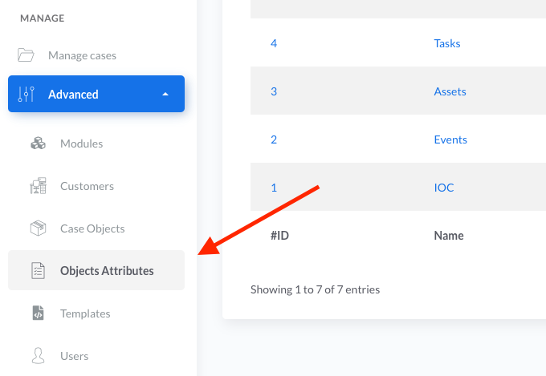

# Custom Attributes 

!!! tip "*Introduced in IRIS v1.4.0*"

All the case objects can be extended with custom attributes. These attributes can be added by : 

- Administrators via the GUI 
- Modules (for instance, the VT module adds a ``VT Report`` attribute to each objects it analyses)

Attributes offer the ability to :

- Add inputs for analysts to fill additional details 
- Add static/dynamic content such as HTML/JS for enhanced possibilities.  

This section only describes how an administrator can add or delete attributes to an object.  

## Management page

Custom attributes can be changed in the ``Advanced`` > ``Objects Attributes`` section on the left panel. 




The page lists the objects for which custom attributes can be added or modified. 

- Cases 
- Customers
- Evidences 
- Notes
- Tasks
- Assets
- Events 
- IOC 

## Attributes structure 

Attributes are defined in JSON which describes tabs and fields that makes the attributes.    

``` json

  {
      "Tab Name 1": {                     // Defines a new tab 
          "Field 1": {                    // Defines a new field within the Tab Name 1
              "type": "input_string",     // Defines the type of field, here a standard string input
              "mandatory": true,          // Indicates whether the field is mandatory upon saving
              "value": ""                 // Default value if any, else empty
          },
          "Field 2": {                    // Defines a second field within the tab Tab Name 1
              "type": "input_checkbox",   // Defines an input checkbox
              "mandatory": false,         // Indicates whether the field is mandatory upon saving
              "value": ""                 // Default value if any, else empty
          }
      },
      "VT report": {                      // Defines a second tab named VT report
          "Content": {                    // Defines a new field Content within the VT Report
              "type": "html",             // Defines an HTML interpreted content
              "value": ""                 // Default value if any, else empty
          }
      }
  }
```

The code above would be rendered as : 


With : 

1. The native information of the object. This cannot be changed or updated
2. The new attribute ``Tab Name 1`` 
3. The other new attribute ``VT report``


## Attributes taxonomy 
The available fields type are available for rendering : 

- ``input_string``: Standard input text
- ``input_textfield``: Standard input textfield
- ``input_checkbox``: Standard checkbox
- ``input_date``: Standard date input
- ``input_datetime``: Standard date and time input
- ``input_select``: Standard select input. Need "options" tag to describe the available options, as a list of string. 
- ``raw``: A static content rendered in raw text. HTML is not be interpreted.
- ``html``: A static content rendered as HTML. This is by nature prone to abuse, but at the same time allows adding custom JS scripts. 


## Updating / resetting attributes 

When an attribute is updated, it will try to update all the existing objects with the new attributes. To prevent any data loss from previous attributes and attributes pushed by modules, the update is only made on attributes which don't have any values set or are type-compatibles (ie string to textfield).  

The migration of an attribute can however be forced in two ways, both resulting in potential attributes data loss.  

!!! tip "Good to know"
    Migrating or overwriting attributes never change the native information of an object. It only applies to custom attributes.  


``Partial overwrite`` basically resets all the values of every target objects that matches the current attribute definition. All associated values are lost. This does not impact attributes pushed by modules or previous configuration.

``Complete overwrite`` resets all attributes of every target objects, including the ones created by modules, and then applies the current attributes. All associated values are lost.