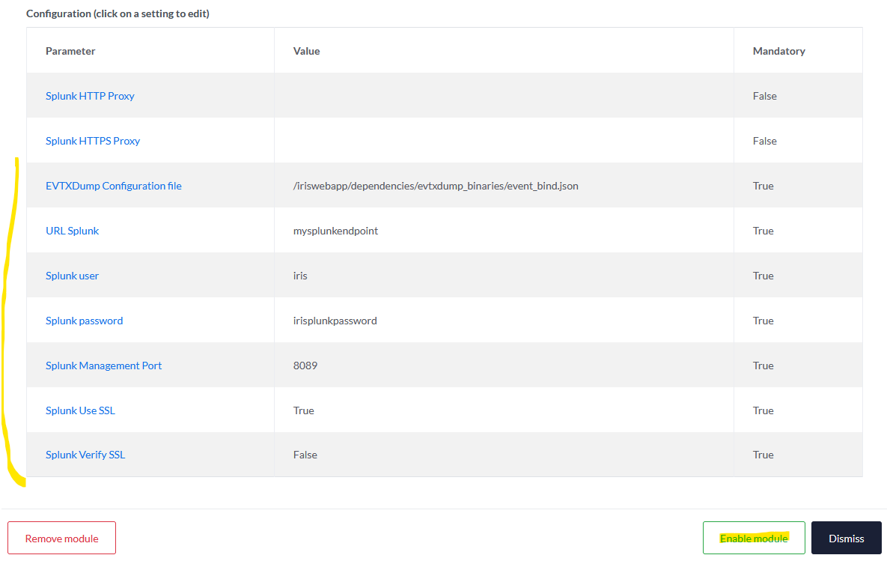

# Modules

IRIS can be extended with modules. They can be split in two types:   

- Pipeline modules : Allow upload and process of evidences through modular pipelines (eg: EVTX parsing and injection into a database or data visualiser)
- Processor modules : Allow processing of IRIS data upon predefined actions / hooks. (eg: be notified when a new IOC is created and get VT/MISP insights for it).

Modules (or DIM - DFIR-IRIS Modules) are actually Python packages which must be installed in the Python environment of iris-webapp and the worker (see Quick Start).
Once installed in the Python environment, modules can be managed in ``Advanced`` > ``Modules``.

!!! info
    This section is only available for users with the Admin role.

By default IRIS embeds multiple DIMs.  

- IrisEVTXModule (installed but not registered)
- IrisVTModule (installed and registered)
- IrisMispModule (installed and registered)
  
Let's take IrisEVTXModule one to explain how one can add and use a new module.

Module management
------------------

To add a module, the user can click on the "+" button:

Then the user must enter the name of the pre-installed module. The name of the pip package must be used.

If everything is ok, the module will appear on the list. It is currently disabled, and needs configuration before it can be enabled. To do so, the user can click on the module's name:

A new text box appears, showing information about the module, and a list of parameters to configure. Each mandatory parameter must be configured to enable the module.

After configuring all the mandatory parameters, the "Enable button" is revealed and the user can finally enable the module.

That's all! The user can confirm in the summary that the module is indeed enabled and ready to use.

Finally, the user can either disable or remove the module by clicking on the according buttons.

Now that the module is configured and enabled, let's see how we can use it!

**NB: As a temporary fix, after adding and configuring a module, one must restart the IRIS services (dockers) else the worker won't have the module installed properly.**

## How to use the module

As stated in the beginning, a module extends the capabilities of IRIS. For now, it allows importing evidences of your needs into what we call a pipeline, where data will be handled in the module (checking, parsing, ingestion...).  
In our provided module, IrisEVTXModule ingest EVTX files, parse them as JSON, and send the results to a Splunk instance using its HTTP event collector (HEC) endpoint.

In IRIS, the files are always imported in the context of a case. To import a file, the user can click on ``Manage cases`` then ``Update`` tab.

In ``Processing pipeline``, the user can pick a pipeline that will send the files to the wanted module. In our example, ``EVTX pipeline`` refers to the IrisEVTXModule module.  
Below, the user can fill the arguments needed by the according pipeline. Arguments can be optional. Finally, the user can import one or several files and click ``Update`` to start their processing by the module.  

You can see in the picture below that the user will import four EVTX files.

The user can follow the upload of the different files with their respective progress bars.

Once uploaded, the status of the task can be observed on the `DIM Tasks` page.

Clicking on a Task ID shows information on the task processing.

After the processing of the files by the module, the list of the imported files is stored in the ``Evidences`` tab of the according case.

